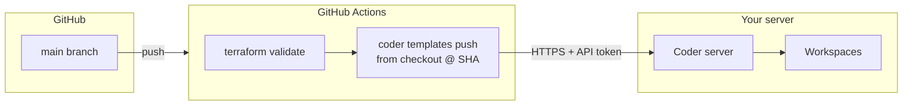

# Template registration: CI as source of truth (recommended)

## Problem

Coolify (and similar) can **preserve** the application directory between deploys. Even with “pull latest,” the path bind-mounted as **`./template` → `/templates`** may **lag behind `main`** or diverge. Post-deploy then runs **`coder templates push`** against **whatever is on disk** — not guaranteed to match the git commit you think you deployed.

## Recommended architecture

1. **`coder templates push` runs in CI** on every push to **`main`** that touches `template/**` (or `VERSION`, or this workflow).
2. The template **is always** the files at **`github.sha`** — the same commit as the workflow run. **No dependency** on Coolify’s preserved repo.
3. **Coolify** deploys **Coder + Postgres + socket** only. Whether Coolify’s copy of `template/` is stale **no longer affects** which Terraform Coder registers (once CI secrets are configured).

## Setup

### 1. Repository secrets

In **GitHub → Settings → Secrets and variables → Actions**:

| Secret | Description |
|--------|-------------|
| **`CODER_URL`** | Public base URL of Coder (e.g. `https://dev.example.com`) — must match what agents use. |
| **`CODER_TOKEN`** | Long-lived API token (create in Coder: **Account → Tokens**). Same permission class as used for Coolify post-deploy. |
| **`SANDBOX_IMAGE`** (optional) | Full image ref for `sandbox_image` (default: `ghcr.io/<owner>/<repo>:latest` lowercased). |

### 2. Workflow

[`.github/workflows/push-coder-template.yml`](../.github/workflows/push-coder-template.yml) installs the Coder CLI, validates Terraform, then pushes **`opencode-sandbox`** from **`./template`**.

Pin **`CODER_CLI_VERSION`** in the workflow to a release compatible with your **Coder server** version if needed.

### 3. Coolify / post-deploy (optional)

You may:

- **Disable** the post-deployment template step in Coolify (or leave **`CODER_TOKEN` unset** in the Coder service so `post-deploy.sh` exits early), **or**
- Keep post-deploy as a **secondary** path — last successful push wins; both should match `main` if Coolify’s checkout is healthy.

**First-time bootstrap:** Before CI secrets exist, register once with **`./scripts/bootstrap-template.sh`** or a one-time post-deploy. After secrets are set, **CI owns** ongoing updates.

## Why this is “clean”

| Approach | Source of truth for `coder templates push` |
|----------|---------------------------------------------|
| Coolify bind mount only | Host directory (can be stale with “preserve repo”). |
| Post-deploy + `POST_DEPLOY_TEMPLATE_SOURCE=auto` | Tarball from GitHub — second path, recovery use. |
| **GitHub Actions** | **Exact git tree at `SHA`** — matches branch policy, review, and tags. |

## Troubleshooting

- **Workflow warns “skipping template push”** — add `CODER_URL` + `CODER_TOKEN` secrets.
- **Push fails with auth** — token expired or wrong URL; recreate token and update secret.
- **Push fails with Terraform** — fix `template/` locally; `terraform validate` runs in CI before push.
